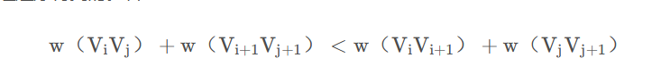
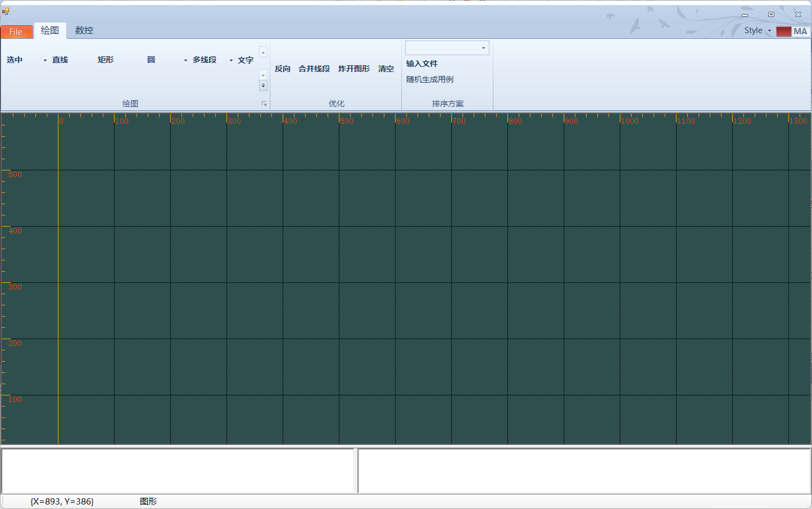
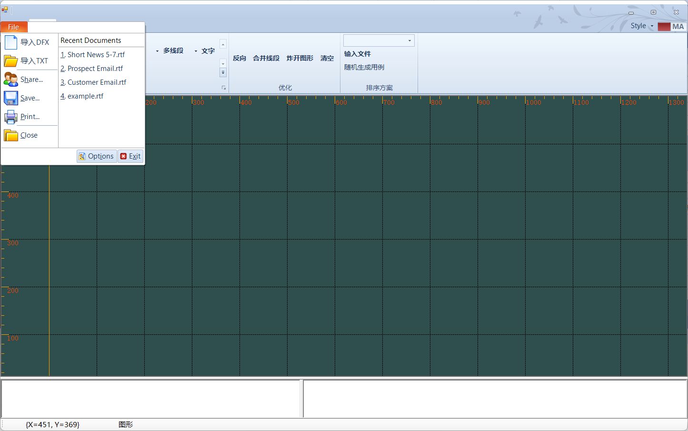
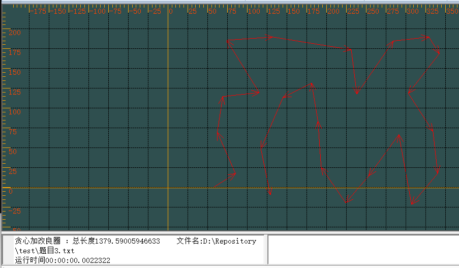
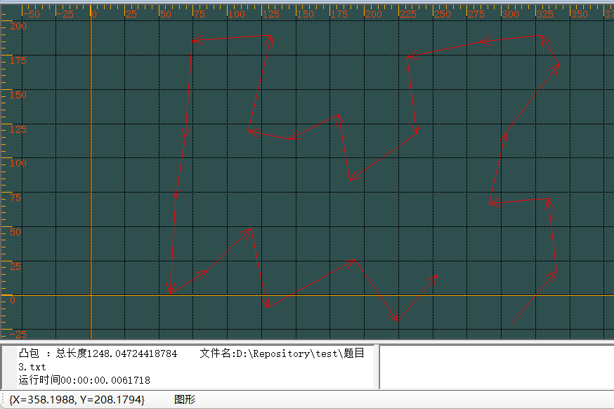
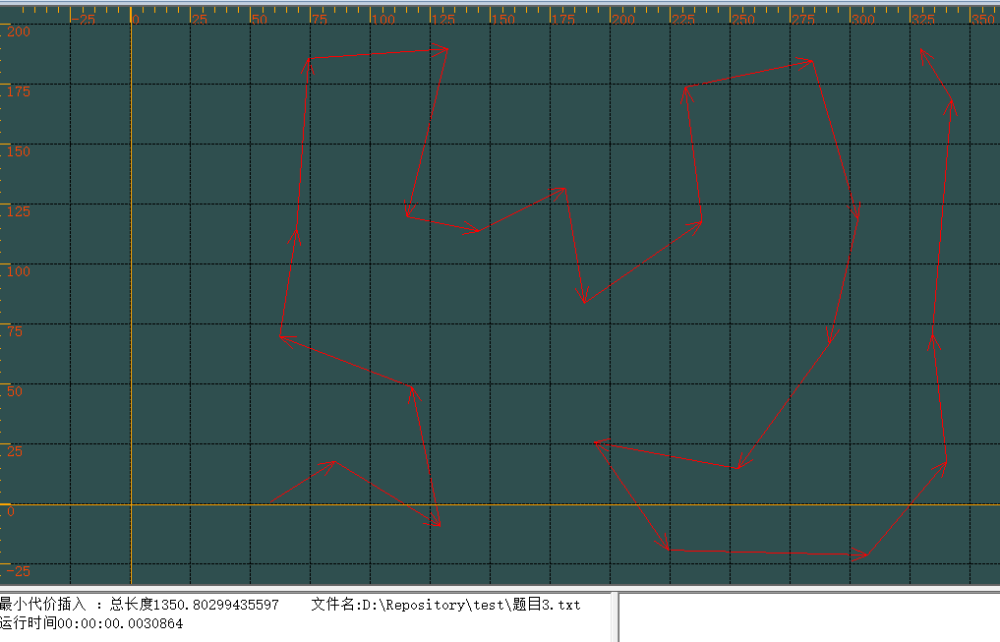
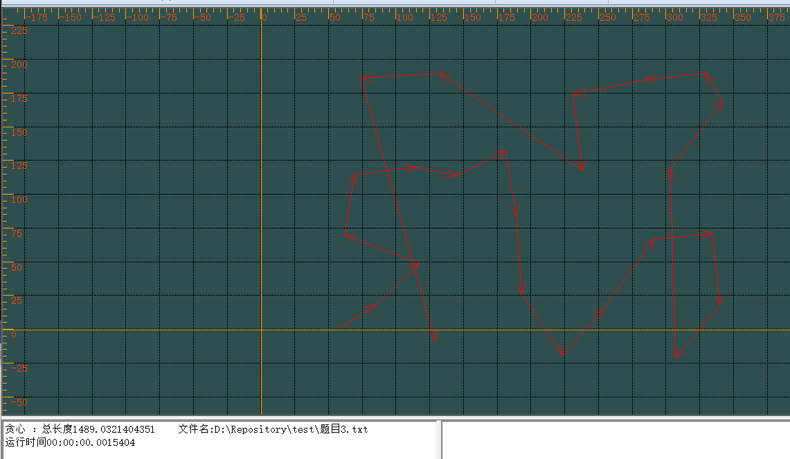

# 类Tsp问题多项式时间算法

徐孜琪 

2022.7-2022.8

## 问题简介

问题描述：将板子上需要切割的各个图案形状抽象成点，已知路径的起点，寻找一条能够遍历所有点的最短路径，也就意味着切割时非切割路径最短，由于该问题为NP完全问题，其最坏情况下的时间复杂度随着问题规模的增大按指数方式增长，到目前为止还未找到一个多项式时间的有效算法，所以我们只能退而且其次，在多项式时间内找到一个逼近最优解的局部解。

问题规模：预计两千个点

时间要求：秒级

## TSP方案

由于时间上的限制，所有智能算法，包括蚁群算法，遗传算法等都不适用，所以这里仅使用多项式时间的算法解决该问题。

另外由于大部分TSP算法都是依据回路性质进行计算，本项目计算的是通路路径，在使用这部分类型的算法是可能会影响最终解的质量。

我将所有算法分为两个复杂度进行对比，O（n^2）和O（n^2logn），更高复杂度的算法如最小权匹配算法考虑到时间要求没有实现。O（n^2）中最近邻点法（也可以叫贪心法）的效果最好，对解的稳定性有一定程度上的保证，剩下插入性算法中最邻近插入，最远插入，任意插入等O（n^2）复杂度算法对解的质量没有保证，会导致最终解的方差会很大，另外C-W节约法（Clark&Wright 算法）也是O（n^2）复杂度算法中非常优秀的算法，有可能效果会比贪心算法更好，考虑到时间问题没有实现，后续可以尝试一下。

O（n^2logn）复杂度算法中我考察了很多种不同类型的算法，易证最优解路径中的所有路径一定是非交叉路径，并且直观上来看非交叉路径也更好，所以除了计算出的最终绝对路径值以外，在算法选用上也会考察该算法会不会避免交叉路径的生成，目前来看在O（n^2logn）中改良圈算法的解质量和运行效率较好，能够完全避免交叉路经的生成，同时算法过程简单易懂，不需要很多复杂的运算，相比之下其他算法需要进行很多运算从而花费更多时间，具体细节将在后续介绍算法时展示。

一般来说复杂度越高的算法得到解的质量也就越好，所以大部分情况下O（n^2）复杂度的算法最后生成的解质量不会比O（n^2logn）更好，同时无法保证非交叉路径的出现，当然特别情况下比如如果整个点集都为方阵点的时候，由于算法本身的一些特性可能会出现O（n^2）复杂度能够得到比O（n^2logn）更优的解。

### 调用方法

直接在外部调用TspPlan类的构造函数可以直接对传入的点集进行运算

```c#
public TspPlan(xPoint stopPt, List<xPoint> emShapelist1, int ChoiceFlag = 2, xPoint endPt = null)
```

参数：

stopPt：代表起始点，算法会寻找距离stopPt最近的点作为路径起点

emShapelist1：传入的点列表，排序过程将直接修改该list的顺序，由于C#引用类型的特点，外部函数可以直接得到修改后的点集，无需做额外处理。

ChoiceFlag：代表选择的方案，默认方案为先贪心后改良圈，具体如下：

```
改良圈: ChoiceFlag = 0
贪心: ChoiceFlag = 1
先贪心后改良圈: ChoiceFlag = 2
最小代价插入: ChoiceFlag = 3
凸包: ChoiceFlag = 5
动态规划（存在bug）: ChoiceFlag = 6
```

endPt：设置终点，默认为null，此时由算法自行寻找终点，若传入终点则会寻找距离endPt最近的点作为路径终点，但是仅对改良圈和最小代价插入算法有效，其他算法由于算法特性无法手动设置终点。

### 主要数据结构

xPoint类，EMShape类：用于表示点坐标

```c#
public class xPoint
{
    public float XPos;
    public float YPos;
}
public class EMShape
{
    public xPoint StartPoint;
    public EMShape(xPoint a)
    {
        StartPoint = new xPoint();
        StartPoint.XPos = a.XPos;
        StartPoint.YPos = a.YPos;
    }
}
```

InsertPt：用于插入性方案，方便比较插入时的代价，存放预备插入节点。

```c#
public class InsertPt
{
    public EMShape Point;//该点坐标
    public double MinCost;//加入子路径时的最小代价
    public LinkedListNode<EMShape> PreInsertNode;//预备插入节点。该点将插入到PreInsertNode后
}
```

DistanceMap：保存所有点之间的距离表

```c#
private List<List<double>> DistanceMap = new List<List<double>>();
```

sumDistance：总路径距离

```c#
private double sumDistance = 0;
```

PointLinkedList：双链表存储点集，主要用于插入性算法

```c#
private LinkedList<EMShape> PointLinkedList = new LinkedList<EMShape>();
```

### 算法整体结构

首先根据StartPt的值寻找起点，

```c#
            double min = Distance(stopPt, PointList[0].StartPoint);
            int StartPt = 0;//设置起点
            for (int i = 1; i < PointList.Count(); i++)
            {
                double cur = Distance(stopPt, PointList[i].StartPoint);
                if (min > cur)
                {
                    min = cur;
                    StartPt = i;
                }
            }
            SwapPt(PointList, StartPt, 0);
```

这里通过if判断ChoiceFlag的值，根据不同ChoiceFlag的值选用不同的方案。

```c#
            if (ChoiceFlag == 0)//单改良圈
            {
                ...
            }
            else if (ChoiceFlag == 1)//单贪心
            {
                ...
            }
            else if (ChoiceFlag == 2)//贪心+改良圈
            {
                ...
            }
            else if (ChoiceFlag == 3) //最小代价插入
            {
                ...
            }
			...
```

Distance：计算两点之间的欧氏距离

```c#
    private double Distance(xPoint a, xPoint b)
```

CalculateSumDistance：计算总距离

```c#
public void CalculateSumDistance(List<EMShape> PointList)
```

SwapPt：交换两点

```
 private void SwapPt(List<EMShape> PointList, int sp, int ep)
```

Reverse：颠倒路径中的点顺序，用于改良圈算法

```c#
private void Reverse(int begin, int end, List<EMShape> PointList, double[] OldpathDistance)
```

### 具体实现算法

#### 贪心（最邻近点法）

基本原理：找到距离最近加入路径最近的点，将其加入路径，直至所有点都加入到路径中

时间复杂度：O（n^2）

该算法应该是最简单的算法之一，只需要一个双循环即可实现，但是效果上很难得到一个比较好的解，这也是O（n^2）复杂度算法的通病，会出现很多的交叉路径，好处是由于算法实现上简单以及较低的复杂度，运行时间非常短。

####     改良圈

基本原理：首先求得一个Hamilton路径，然后修改路径得到具有较小权的另一个Hamilton路径，直至无法改进则停止，在修改圈时颠倒路径中的一条子路径，比较颠倒前后的路径长度，如下图所示，若新路径更短则更新路径，若旧路径更短则不变。



在实现上，我做了一定程度上的优化，将当前路径（旧路径）存放在一个数组当中，这样在每次比较过程中无需对原有路径进行计算，只需要计算颠倒后的新路径，大概能节省一半的计算量，但是由于该算法的主要开销还是在颠倒过程的循环中，时间复杂度无法降低，优化效果有限，只能降低一部分时间。

时间复杂度：约为O（n^2*logn）

在相同复杂度中，该方案计算过程较为简单，运算时间可以得到保证，并且由于算法特性不会出现交叉路经，直观感觉较好，在测试中路径总长度也比其他算法优秀，方差较小，但是改良圈算法在迭代过程中不会更改终点，需要提前确定终点。

#### 先贪心后改良圈

该方案为改良圈的优化方案，由于改良圈本身是一个回路性算法，无法自行决定终点，计算过程中我将距离起点最远的点作为终点，但是这会影响解的质量，最后考虑先进行一次贪心算法找到一条较好的路径，同时可以确定终点，由于贪心本身可以得到一条较好解，所以可以减少改良圈的迭代次数，优化运行时间。

####     动态规划

状态转移方程：

令d(i, V’ )表示从顶点i出发经过V’ 中各个顶点一次且仅一次，开始时， V’ ＝V－{i}，方程如下

```
d(i, V’ )=min{cik+d(k, V’ －{k})} (k∈V’)
d(k,{})=cki (k≠i) 
```

时间复杂度跟空间复杂度高达n*2^n

本想用动态规划得出最优解方便与其他算法进行对比，但是该方法的时间复杂度和空间复杂度过高，基本上二三十个点就会内存溢出，最终放弃了该方法，后续可以考虑对其空间复杂度进行优化，但是时间复杂度应该很难再降低了，所以该方法只能作为对比方案，不能用于实际工程。

####     凸包算法

基本原理：凸包算法分为两部分，构建凸包和点插入

- 第一部分是构建凸包，这里选用了Graham扫描法，时间复杂度为O（nlogn），时间复杂度更低的Melkman算法只适用于简单图，无法处理完全图，具体过程如下：

```
（1）选取最下左的点P0。
（2）计算出每个点相对于P0的角度和距离(利用这个来排序)排序。
（3）设点数为n，将p[n-1]和p[0]入栈，判断点集合是否为一条直线（初始k=2表示当前凸包的大小）。
（4）i 从1到 n-1 遍历，对于p[k-1],p[k-2],p[i]若满足左转，将p[i]压入栈。否则就 i-- ，k-- 。
（5）k-- ，返回k表示凸包的点数。
```

最终得到一个包含所有点的凸包

- 第二部分是插入凸包内部的点，在构建凸包后，计算内部点插入凸包路径的代价，每次插入一定会增加凸包路径长度，所以我们需要在每次插入时比较每个点的代价并选取代价最小的点。在计算代价时我预设了两种方案，令i和j为凸包上点，r为将要插入的点
  - 将Distance[i,r]+Distance[r,j]- Distance[i,j]作为代价，将结果最小值插入
  - 根据∠irj 大小，将角度最大值插入，

大致过程如下，这里为了提高插入效率选用了链表形式：

```
//构建初始距离表
for InternalPoint in InternalPtList
	for ConvexHullPoint in ConvexHullList
		比较当前代价CurCost与该点预存的最小代价InternalPoint.MinCost，当前代价较低则更新最小代价			MinCost和预插入节点PreInsertNode
//插入点集
for i in InternalPtList.Count//依次将内部点插入凸包点集中，迭代次数等于内部点个数
	//插入代价最小点
	for InternalPoint in InternalPtList
		找到代价最小的插入点，保存在InsertNode中
	将InsertNode插入到预插入节点PreInsertNode后并删除InternalPtList中的InsertNode
	//更新路径表
	for InternalPoint in InternalPtList
		//更新路径值时，如果已插入点InsertNode的预插入节点与当前待插入点相同，说明该待插入点原有的索引点的路径消失，需要重算该待插入点最小插入代价和对应索引点
		if (InsertNode.Value.PreInsertNode == InsertPointNode.Value.PreInsertNode)
			重算该待插入点最小插入代价和对应索引点
		//待插入点原有的索引点的路径未消失
		else
			将原有的最小插入代价与新增的两条路径所计算出的代价进行比较，选取代价最小的点并更新预插入点
```

该部分时间复杂度：O（n^2*logn）

总时间复杂度O（n^2*logn）

该方法为回路性算法，相当于一个大的凸包回路慢慢向内塌缩，最终将所有节点加入到回路当中，极端情况下出现交叉路径，原因可能是点数量较多导致图形过于复杂，遍历过程中无法找到不产生交叉路经的待插入点，并且会受到代价方案的影响，目前测试下来以距离计算作为代价时出现的交叉路径最小，但是无论用哪种代价方案，解的质量和运行时间一般不如改良圈算法。

####     最小代价插入

思路类似凸包，区别在于必须定义起点终点，一开始只有起点终点在目标路径中，其他所有点为待插入点，然后根据插入代价将其余点依次插入路径中，计算过程与凸包类似，这里不再赘述。

时间复杂度：O（n^2*logn）、

插入流程与凸包算法很相似，但是相比于凸包算法减少了凸包建立过程，减少了计算量，但是实际测试过程中发现运行实现并未明显减少，可能是因为待插入点以及目标路径上的过少过多导致每次都需要更新路径表，可以考虑修改插入时的具体实现方式，不使用路径表的方法，有待优化，但是同样极端情况下会出现交叉路径，解的质量不如改良圈算法。

### 已排除算法

以下是在了解算法性质后已经淘汰的算法，预计以下算法的解质量不如目前几个已经实现的算法。

#### 贪婪算法

基本思路：

```
(1)给所有边按长度排序
(2)选择最短的满足条件的边加入到路径中。条件：不会构成小于N条边的环路
(3)重复Step 2，直至路径中有N条边。
```

时间复杂度：O(n^2*log2(n))

结果上可能未必会差，但是该算法完全无法阻止交叉路径出现，直观上解的质量不如以上几种同复杂度的算法，另外由于我们一开始只有点集，需要自行计算所有边的长度，影响运行时间，个人认为不如以上几种算法。

#### 最邻近插入

```
(1)任选一个点 i，作为子路径（只包含一个结点的子路径）
(2)找到距离i最近的点r，形成子路径 i-r-i
(3)选择。找到不在子路径中的点r，使它到子路径中的点的最小距离是所有不在子路径中的点到子路径中的点的最小距离中最小的。这个距离是连接这两类点的最小距离
(4)插入。在子路径中找到这样一条边（i，j），使Distance[i][r]+Distance[r][j]-Distance[i][j]最小。将r插入到i和j中间
(5)执行Step 3，直到所有点都加入到了路径中
```

#### 最远插入

```
(1)任选一个点 i，作为子路径（只包含一个结点的子路径）
(2)找到距离i最远的点r，形成子路径 i-r-i
(3)选择。找到不在子路径中的点r，使它到子路径中的点的最大距离是所有不在子路径中的点到子路径中的点的最大距离中最大的。这个距离是连接这两类点的最大距离
(4)插入。在子路径中找到这样一条边（i，j），使Distance[i][r]+Distance[r][j]-Distance[i][j]最小。将r插入到i和j中间
(5)执行Step 3，直到所有点都加入到了路径中
```

#### 任意插入

```
(1)任选一个点 i，作为子路径（只包含一个结点的子路径）
(2)找到距离i最近的点r，形成子路径 i-r-i
(3)选择任意不在子路径中的点插入到子路径
(4)重复Step 3，直至所有点加入到子路径
```

​    三种算法放在一起讨论时间复杂度皆为O(n^2），从算法过程可以看到，三种算法随机性很高，对于解的质量基本没有保证，可能会导致解质量的方差很大，另外计算过程远远比贪心算法复杂。

#### 双生成树算法

```
(1)由城市的点集构造最小生成树
(2)重复所有的边，由此容易构造出Euler回路
(3)去除Euler回路中的重复点，形成回路解
```

时间复杂度：O(n^2)

该算法本质是先构建一个欧拉回路然后通过”抄近路“生成哈密顿回路，对于解的质量有一定程度上的保证，结果路径总长度一定小于最优解的两倍，但是对于大规模的点集来说两倍依旧会导致巨大的误差，另外该算法极易出现交叉路径，作为回路算法会影响解的质量，所以最终没有考虑实现。

## CAD绘图软件

其主要功能由包俊杰包总完成，本人在基础上增加了一部分功能方便算法测试以及结果展示



添加功能如下：

##### txt文件读取



左上角可以导入TXT文件并在界面中显示路径，文件格式如下（该文件格式与排序方案中的输入文件格式相同）：

```
13 99
96 92
158 8
185 61
182 70
294 99
235 122
152 97
158 196
```

其中第一列为横坐标，第二列为纵坐标。

##### 清空界面

点击清空按钮可以清空所有界面上的点和路径，每当导入文件时会自动先调用清空功能。

##### 输入文件自动排序

- 选取排序方案，在combox中选取一种排序方案，若未选择则自动使用先贪心后改良圈的方法。
- 输入文件，选取完排序方案之后导入一个txt文件，该文件格式与上述**txt文件读取**相同，后续会自动对文件中的点集进行排序并显示在界面当中。
- 显示排序花费时间和排序后的路径总长度，方便进行对比。
- 随机生成用例文件，该文件会在exe文件的文件夹中，用例中点的数量可以在代码中调整。

### 测试

题目三：

- 贪心加改良圈



- 凸包



- 最小代价插入



- 贪心



### 结论

目前改良圈算法的解质量基本达到要求，相比于原本的最邻近点算法有了不错的提升，但是运行时间的优化上陷入瓶颈，在时间复杂度不变的情况下很难使运行时间有质的提升，可以考虑实现O(n^2）复杂度的C-W节约法，但是可能需要牺牲一部分解的质量，或者寻找一种新的O(n^2*log2(n))复杂度的算法。
